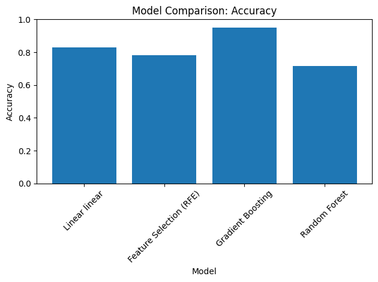
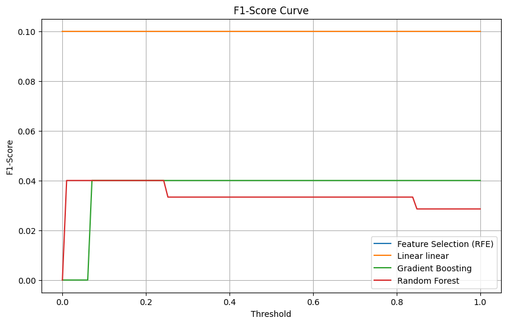

# Student Performance Perdiction
## Why This Project

Predicting student performance using machine learning offers invaluable insights into educational dynamics. By utilizing up-to-date and freely available datasets, the project provides the following benefits:

## Benefits

- **Informed Decision-Making:** Updated data enables educational institutions to make informed decisions, guiding interventions, curricular modifications, and policy implementations.

- **Enhanced Prediction Precision:** Freely available datasets facilitate trend examination, leading to more accurate predictions and wiser decision-making in the field of student performance prediction.

## Dataset

The dataset used in this project, sourced from the UCI Machine Learning Repository, comprises 33 attributes related to students' personal characteristics, family background, behavior, and academic achievements. Noteworthy attributes include 'G1', 'G2', and 'G3,' representing grades in either the Math or Portuguese course.

### Dataset Structure:

- Number of Columns (Attributes): 33
- Number of Instances (Rows): Varies based on the number of students in the dataset

### Exploratory Data Analysis (EDA) Visualizations:

- **Distribution of Final Grades (G3):** Visualize the overall performance of students through a histogram of final grades (G3).

- **Correlation Heatmap:** Understand the correlation between different attributes and final grades (G3) through a heatmap.

- **Box Plots for Categorical Attributes:** Relate categorical attributes like 'sex,' 'school,' and 'address' to the distribution of final grades (G3).

- **Scatter Plots for Numeric Attributes:** Explore the relationship between numeric attributes like 'age,' 'absences,' and 'freetime' and final grades (G3).

- **Bar Plots for Categorical Attributes:** Visualize the distribution and impact of categorical attributes like 'internet,' 'romantic,' and 'activities' on final grades (G3).

- **Pair Plots:** If feasible, create pair plots to visualize pairwise relationships between multiple numeric attributes and the final grade (G3).

## Machine Learning Model Development and Evaluation

The project employs a regression approach, specifically Linear Regression, to predict students' final grades (G3). The model development process involves data preprocessing, feature selection, model training, and evaluation using various metrics.

### Evaluation Metrics:

1. **Confusion Matrix:** Visualize the classification performance of the model, providing insights into true positives, true negatives, false positives, and false negatives.

2. **Precision-Recall Curves:** Identify the trade-off between precision and recall at different probability thresholds, aiding in the selection of the best threshold for the model.

3. **Accuracy:** Quantify the proportion of correctly predicted instances out of the total instances.

4. **F1-Score:** Provide a balanced assessment of the model's performance, considering both precision and recall.

# Results

The Linear Regression model, utilized in the experiment, demonstrated successful outcomes in predicting students' academic performance. The provided images showcase the results, including the correlation heatmap, precision-recall curves, accuracy, and F1-score, contributing valuable insights to the field of student performance prediction.

The project aims to advance educational analytics and foster evidence-based decision-making in academic institutions.
